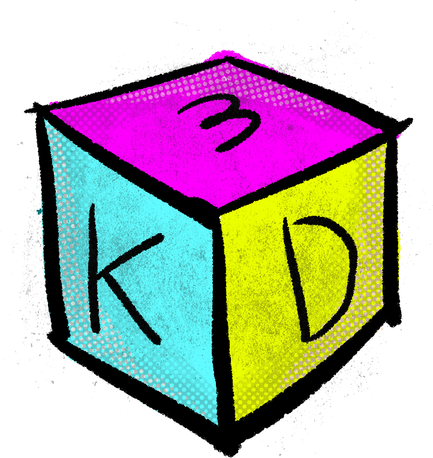
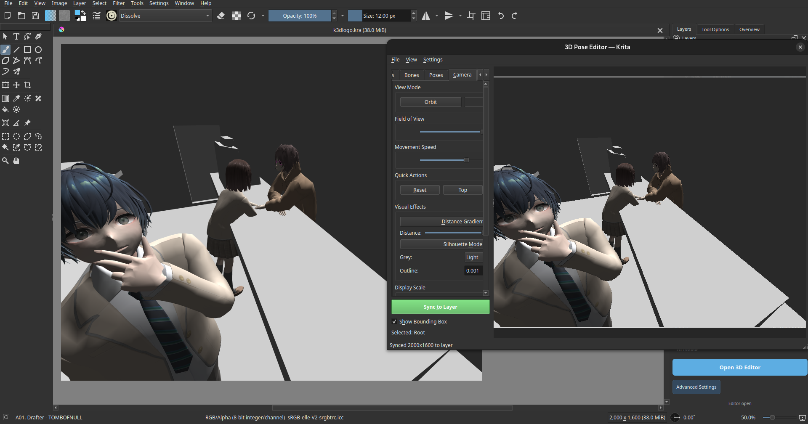

# K3D - Krita Model Posing Plugin



[](https://opensource.org/licenses/MIT) [](https://krita.org/)

A plugin for Krita that enables 3D character posing with skeletal animation support, transform gizmos, and multi-model scene management.



Admittedly, this was made because I have no idea how to draw in perspective and I needed a tool to show me how. And I can't have Blender and Krita open at the same time. All the best to the dev of the blender layer plugin!

## Requirements

### Required
- Krita 5.0.0 or later
- Python 3.8 or later (Krita bundles Python 3.10)

### Optional (auto-installed)
- PyQt5 5.15.0+ (bundled with Krita)
- PyOpenGL 3.1.0+ (required for 3D rendering)
- NumPy 2.0.0+ (required for GPU buffer preparation)

### Supported Platforms
- Linux (64-bit)
- Windows (64-bit)
- macOS (Intel and Apple Silicon)

## Installation

1. Download or clone this repository
2. Run the installer:

```bash
python install.py
```

The installer will:
- Detect your Krita Python directory automatically
- Copy the plugin packages to the correct location
- Install required dependencies (numpy, PyOpenGL) into Krita's Python environment

3. **Restart Krita** to load the plugin

### Installer Options

- `--clean` - Remove old dependency packages before installing
- `--force-deps` - Force reinstall of numpy and PyOpenGL even if already present

## Quick Start

1. Open Krita and go to **Settings > Dockers > 3D Pose**
2. Click the **"Open 3D Editor"** button in the 3D Pose docker
3. The 3D Pose Editor window opens with a viewport and tab panels
4. **Models** - Click "Add" to load a `.glb` file
5. **Bones** - Select a bone in the tree to edit it with gizmos
6. **Poses** - Save and load pose snapshots
7. **Camera** - Switch between orbit/head-look modes, adjust FOV, manage bookmarks
8. **Scene** - Save and load complete project scenes

## License

MIT License - see [manifest.json](krita_3d_pose/manifest.json) for details.